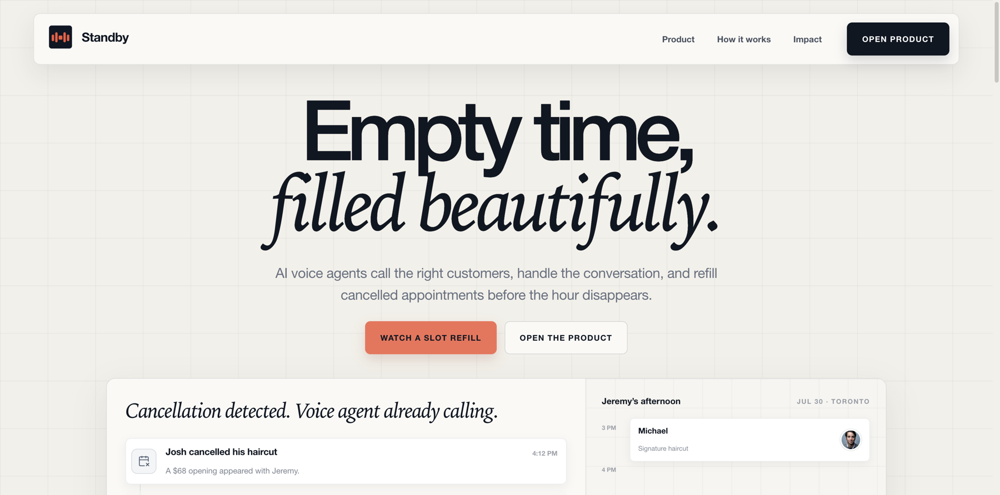
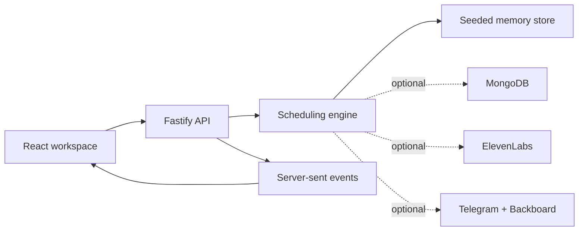

<p align="center">
  
</p>

<h1 align="center">Standby</h1>

<p align="center">
  <strong>Empty time, filled beautifully.</strong><br />
  AI voice agents that turn cancelled appointments into confirmed bookings.
</p>

Standby is a hackathon-built scheduling demo for appointment businesses. When a
cancellation opens a slot, it ranks suitable customers, starts the outreach,
and records the first confirmed replacement back onto the calendar.

The interface is the product: a polished landing page and a seeded front-desk
workspace that can be explored without provider credentials or external data.
The original voice, messaging, and persistence adapters remain available for
experimentation, but the default runtime is deliberately self-contained.

## Product loop

1. A cancellation creates an opening with a service, employee, time, and value.
2. Eligible customers are ranked from the waitlist and upcoming schedule.
3. The demo agent offers the opening with the relevant context.
4. Availability and consent are checked again before the booking is committed.
5. The calendar, conversation ledger, and customer record update together.

## Architecture



The language model side can propose actions; the TypeScript domain layer owns
identity, consent, availability, conflicts, offer expiry, and state mutation.
That separation keeps the interesting scheduling logic deterministic even when
the conversational integrations are not configured.

## Tech stack

| Layer | Technology |
| --- | --- |
| Frontend | React, TypeScript, Vite, Tailwind CSS, Lucide |
| API | Node.js, Fastify, Zod, Pino |
| Scheduling | TypeScript state transitions, Luxon, optimistic version checks |
| Demo data | Seeded in-memory store |
| Optional integrations | MongoDB, Backboard, ElevenLabs, Telegram |
| Live updates | Server-sent events |
| Hosting | Vercel static CDN and serverless functions |
| Quality | Vitest, Testing Library, TypeScript |

## Project map

```text
src/web/               landing page and operator workspace
src/domain/            scheduling rules and recovery engine
src/server/            API, seeded demo state, and provider adapters
api/handler.ts         Vercel serverless bridge
public/landing/        optimized brand and landing assets
```

## Run locally

```bash
npm install
npm run dev
```

Open `http://127.0.0.1:5174` for the landing page and `/app` for the product.
The default command always uses the seeded memory store, so it works without an
`.env` file. Copy `.env.example` and run `npm run dev:api:integrations` only when
working on the optional provider adapters.
